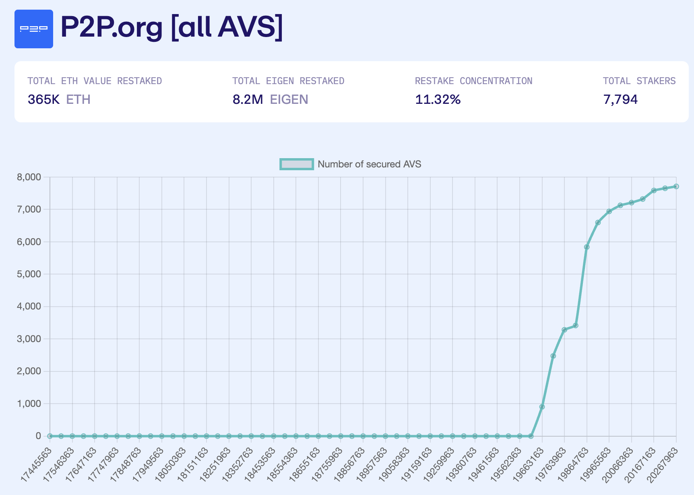

# kya-extension

KYA: Know your AVS!

Injected code on EigenLayer to dynamically score AVS

# Introduction

Welcome to KYA (Know Your AVS), the innovative extension that empowers restaking users on EigenLayer by scoring operators and AVS, enhancing EingenLayer's data and boosting the UX with awesome charts (though injected scripts on EigenLayer)!

Understanding the potential risks of AVS (Actively Valited Services) is essential to every DeFi user. Even if we are only at the beginning of this new economy, we must be aware of the new risks that AVS, operators and restaking can bring, including slashing risks, smart contracts contracts and governance risks.

We have developed several metodologies to assess the risks of each factor, in real-time with blockchain indexation (through subgraphs).

# Example

